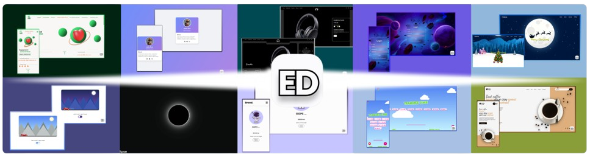

<!-- // ANIMATED BANNER // -->

  

<!-- // IMG BANNER // -->

  

<!-- // TEXT OF PRESENTATION // -->

  <em>👋 Hello! I'm Ethan, a French Computer Science student passionate about crafting elegant UI/UX designs. 🌐 I love working on front-end development, turning ideas into sleek and functional websites. 🚀 Dive into my projects and let’s connect! 🤝</em>

<!-- // COMPTER // -->

  

<!--// SEPARATOR // -->

  

<!-- // SOCIAL NETWORKS // -->
<h2 align="center">📱 Follow Me</h2>

  
  

<!-- // IMG  // -->

  

<!-- // TECHNOLOGIES // -->
<h2 align="center">💻 My Technologies</h2>

  

<!-- // TOOLS // -->
<h2 align="center">🛠️ Tools</h2>

  

<!-- // TECHNOLOGIE IN PROFRESS // -->
<h2 align="center">🚀 Technologies in Progress</h2>

  

<!-- // IMG  // -->

  

<!-- STATS GITHUB -->
<h2 align="center">🏆 GitHub Stats</h2>

  
    

  
  
  
   

  

